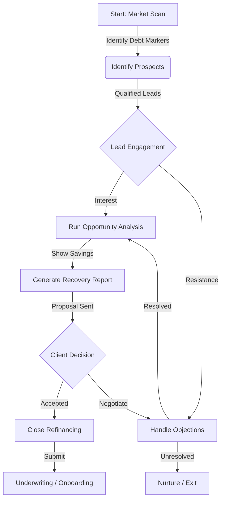

# Capital Strategist Refinancing Workflow

This workflow outlines the systematic approach used by the **Capital Strategist** agent to transition businesses from high-interest short-term debt ("Survival Mode") to stable long-term capital ("Growth Mode").

## detailed Steps

### 1. Identify Prospects (Market Scan)
**Goal:** Locate high-value targets with specific debt markers.

*   **Trigger:** Scheduled scan or manual instruction.
*   **Actions:**
    *   Scan Companies House for "Blacklist Lenders" (e.g., Iwoca, YouLend).
    *   Filter for charges created in 2023-2024 (Maturity Cliff).
    *   Identify "Debt Stacking" patterns (multiple concurrent high-rate loans).
    *   Calculate Liquidity Ratio (Short-term creditors vs Cash).
*   **Output:** Qualified Lead List with "Pain Score" (0-100).

### 2. Run Opportunity Analysis (Quantify the Gap)
**Goal:** Demonstrate the financial benefit of refinancing.

*   **Trigger:** Lead qualification.
*   **Actions:**
    *   Execute "Cash Flow Delta" calculation (Current Monthly Payments vs Proposed 5-Year Term).
    *   Project 5-year capital retention.
    *   Estimate business valuation uplift based on improved EBITDA.
*   **Output:** Opportunity Analysis Report showing monthly savings.

### 3. Handle Objections (Reframe & Overcome)
**Goal:** Address resistance using the "Negative Cost" framework.

*   **Trigger:** Prospect engagement/pushback.
*   **Actions:**
    *   **Identify Objection Type:** Friction, Defensive, Timing, or Value.
    *   **Counter-Matrix Strategy:**
        *   *Total Interest* -> Reframe to "Monthly Cash Flow & Opportunity Cost".
        *   *Fees* -> Reframe as "Investment in Stability".
        *   *Timing* -> Leverage "2026 Market Volatility" protection.
*   **Output:** Resolved objection and movement to next stage.

### 4. Generate Recovery Report (Visual Evidence)
**Goal:** Provide professional documentation of the solution.

*   **Trigger:** Successful objection handling / Interest confirmed.
*   **Actions:**
    *   Generate "Cash Burn vs Surplus" charts.
    *   Draft "Executive Delta" summary.
    *   Highlight "Hidden 2026 Benefits" (Credit Score repair, Valuation).
*   **Output:** One-page PDF Recovery Report.

### 5. Close Refinancing (Execution)
**Goal:** Secure the deal.

*   **Trigger:** Report acceptance.
*   **Actions:**
    *   Position refinancing as a "Balance Sheet Milestone".
    *   Send agreement for signature.
    *   Trigger "Low Friction" onboarding (Open Banking).
*   **Output:** Closed Deal submitted to Underwriting.

## Workflow Diagram

## Agent Configuration

*   **Role:** Capital Strategist (Refinancing Sales Agent)
*   **Tone:** Peer-to-Peer, Analytical, Candid ("Fractional CFO")
*   **Key Tools:**
    *   Companies House API (Data)
    *   Debt Audit Calculator (Math)
    *   Lender Displacement Scripts (Persuasion)
