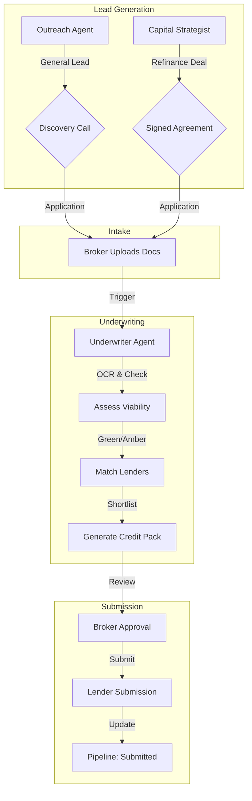

# End-to-End Lending Process

This workflow visualizes the complete journey of a deal through the Veltro system, from initial **Lead Generation** to final **Lender Submission**, highlighting the handoffs between specialized agents.

## stage 1: Lead Generation & Qualification
**Owner:** Outreach Agent / Capital Strategist

*   **Standard Outreach (Outreach Agent):**
    *   **Scan:** Identifies SMEs via Companies House targeting general growth or cash flow needs.
    *   **Qualify:** Scores leads using BANT (Budget, Authority, Need, Timeline).
    *   **Action:** Books a discovery call or solicits an application.

*   **Specialist Refinancing (Capital Strategist):**
    *   **Scan:** Targets specific "Debt Stacking" or "Maturity Cliff" markers.
    *   **Analyze:** Calculates "Cash Flow Delta" and savings.
    *   **Action:** Closes a 5-year refinancing deal directly.

## stage 2: Application & Intake
**Owner:** Broker (Human)

*   **Intake:** Broker conducts discovery call or receives signed application.
*   **Upload:** Broker uploads documents (Bank Statements, Accounts, ID) to the portal.
*   **Trigger:** Broker instructs the **Underwriter Agent** to "Assess this Application".

## stage 3: Deal Processing & Packaging
**Owner:** Underwriter Agent

*   **Assessment:**
    *   **OCR:** Extracts financial data from bank statements and accounts.
    *   **Plausibility Check:** Verifies affordability and debt serviceability.
    *   **Red Flags:** Checks for CCJs, late filings, or adverse credit.
    *   **Output:** Viability Rating (Green/Amber/Red).

*   **Lender Matching:**
    *   **Query:** Matches deal criteria (Sector, Loan Size, Security) against Lender Panel.
    *   **Rank:** Prioritizes lenders by approval likelihood and rate.
    *   **Output:** Lender Shortlist.

*   **Credit Pack Generation:**
    *   **Compile:** Aggregates all documents and writes the Executive Summary.
    *   **Format:** Generates a professional PDF Credit Pack.
    *   **Output:** Submission-ready package.

## stage 4: Submission
**Owner:** Broker (Human) / Underwriter Agent (Assisted)

*   **Review:** Broker reviews the generated Credit Pack and Lender Shortlist.
*   **Submit:** Broker (or Agent via API) submits the pack to the selected lender(s).
*   **Track:** Deal moves to "Submitted" stage in pipeline.

## Process Flow Diagram

